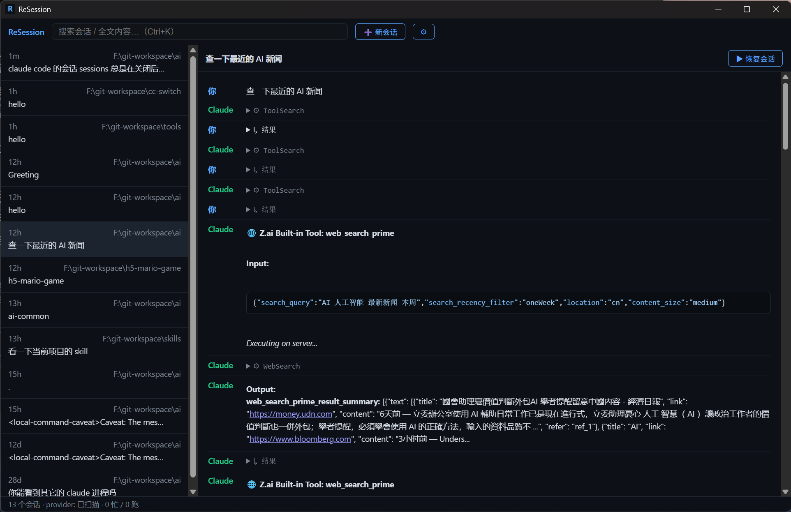

# ReSession

<p align="center">
  
</p>

<p align="center">
  轻量的<strong>原生</strong>本地 Agent 会话管理器——Claude Code 与 Codex，一个入口。<br/>
  <a href="README.md">English</a> · <a href="docs/">文档</a>
</p>

---

ReSession 统一浏览、搜索和回放本地 Claude Code 与 Codex 会话；恢复时启动对应的原生 CLI，不代理 Agent 协议。

## 核心原则

1. **原生会话唯一事实源**——读取 Claude 的 `~/.claude/projects/` 和 Codex 的 `~/.codex/sessions/`；恢复时在真终端运行对应 CLI。不代理协议、不重渲染 TUI、不建私有会话格式
2. **薄壳**——全用现成轮子：Tauri 2（≈10MB 绿色单文件）、xterm.js、portable-pty
3. **Agent 无关核心**——Claude、Codex 的格式和命令各自收口在 `SessionProvider` 适配器里

## 功能

- **找会话**——跨全部项目浏览；标题模糊搜索 + 会话正文全文搜索（防抖、缓存加速、命中高亮）
- **看回放**——只读转录渲染：markdown、代码高亮、工具调用/子 agent 段落折叠
- **恢复**——一键在内嵌真终端运行 `claude --resume` 或 `codex resume`，全彩 TUI 原样运行
- **并行**——PTY 常驻后端（以会话 id 为键），切走切回不丢；忙/闲圆点实时显示哪个在干活
- **开新的**——选择 Claude 或 Codex，在任意目录启动全新会话（已知项目 / 文件夹选择器 / 手动路径）
- **改名**——非破坏性别名存在 ReSession 自己的配置里；原生 `/rename` 标题也能识别
- **绿色单文件**——约 10MB exe，CRT 静态链接；运行期只依赖系统自带组件（WebView2、系统 UCRT）

## 当前状态

Claude 功能已在 Windows/macOS 使用；Codex Provider 已进入开发分支，原生恢复与发布产物仍待完整实测。Codex 原生会话暂不支持在 ReSession 中移入废纸篓。

## 安装

**绿色 exe（推荐）**：从 [Releases](../../releases) 下载 `resession.exe`，放哪都行，双击即用。浏览与搜索只读原生会话；显式删除 Claude 会话时会移入系统废纸篓。ReSession 自有设置和日志存于 `~/.resession/`。

**源码构建**：

```bash
npm install
npm run tauri build -- --no-bundle   # → src-tauri/target/release/resession.exe
```

需要 Node ≥ 20、Rust（Windows 用 MSVC 工具链）和 VS Build Tools C++ 工作负载。细节见 [docs/build.md](docs/build.md)。

## 开发

```bash
npm run tauri dev     # 完整开发模式（vite + 热重载）
npm run dev           # 纯前端浏览器模式（mock 数据）
cargo test            # Rust 核心与 Tauri 测试（含 DTO 契约）
```

⚠️ **debug 版 exe 不能直接双击**：debug 构建加载 `devUrl`（localhost:5173），必须先有 vite 开发服务器（即用 `tauri dev`），否则窗口报 `ERR_CONNECTION_REFUSED`。单独运行请用 release 版。更多坑见 [docs/build.md](docs/build.md)。

## 文档

| 文档 | 内容 |
|---|---|
| [docs/design.md](docs/design.md) | 目标、非目标、设计原则、UI 布局 |
| [docs/architecture.md](docs/architecture.md) | 模块划分、`SessionProvider` 接口、数据流、平台矩阵、ConPTY 实战笔记 |
| [docs/data-formats.md](docs/data-formats.md) | Claude/Codex JSONL 实测格式与 IR 定义 |
| [docs/build.md](docs/build.md) | 构建模式、环境前置、踩坑实录、产物检查清单 |
| [docs/roadmap.md](docs/roadmap.md) | 里程碑与进度 |

## License

[MIT](LICENSE)
