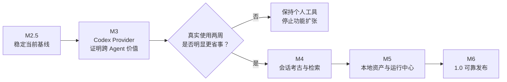

# ReSession Roadmap

> 更新日期：2026-09-24
> 当前开发版本：`0.5.0`（M3 待 Rust 编译与原生恢复验收）；最近已发布版本：`v0.3.2`

## 产品定位

ReSession 不与 Claude App、Codex App 竞争完整的 Agent 体验，也不重做聊天协议、
任务编排或 Git 工作流。

它的目标是成为：

> **跨 Agent 的本地会话搜索、恢复与运行状态中心。**

核心价值依次是：

1. 跨 Claude Code、Codex CLI 等本地 Agent 统一发现和搜索会话；
2. 直接读取原生会话文件，保持本地优先和数据所有权；
3. 精确找回历史上下文，并回到真正的原生 CLI；
4. 管理多个正在运行的本地 Agent 终端，但不代理或改写其协议。

## 路线总览

版本号是建议目标，不是发布承诺；每个阶段必须独立可验收。

## 已发布基线 — v0.3.2

已经具备：

- Claude Code 会话跨项目扫描、分组和增量缓存；
- JSONL 宽容解析与统一 IR；
- 标题、正文全文搜索和命中高亮；
- Markdown 转录、代码高亮、工具调用和 sidechain 折叠；
- 原生 `claude --resume` 与新会话 PTY；
- 多 PTY 常驻、输出快照、运行状态和忙闲提示；
- 会话别名、归档、恢复、移入系统废纸篓；
- 项目树、可调侧栏、运行中会话条和紧凑 UI；
- 更新检查、Windows/macOS CI 产物及 macOS `.app` 构建。

当前最重要的限制：

- 只有 Claude Provider，尚未证明“跨 Agent”价值；
- 部分失败仍以日志或静默方式处理，用户侧反馈不足；
- PTY 生命周期、坏数据和大会话仍缺少系统性验证；
- 搜索能找到消息，但还不能稳定精确定位到转录中的命中位置。

---

## M2.5 — 稳定当前基线（建议 v0.4.0）

目标：让现有 Claude 版本达到放心日用，再扩展第二个 Provider。

### 功能与工程任务

- [x] 修复 PTY 子进程自然退出后仍残留在运行列表的问题；
- [x] 为扫描、搜索、恢复、新建、删除失败提供统一可见错误提示；
- [ ] 验证归档、恢复、移入废纸篓的安全边界和失败回滚；
- [x] 增加坏 JSONL、缺字段、目录失效、二进制不存在等测试；
- [x] 对 100、500、1000 个会话记录冷启动、重扫和搜索耗时（examples/bench.rs，结果见 docs/benchmarks.md：1000 会话热扫 37ms / 冷扫 165ms / 热搜索 83ms，远低于阈值）；
- [x] 大会话渲染实测（20k 事件）：手写窗口化渲染（IntersectionObserver 扩窗 + 滚动锚定 + memo），加载 8s→秒开、滚动卡顿消除，零新依赖；
- [ ] 固化 Windows、macOS 发布产物的启动冒烟检查；
- [x] CI 固定执行 Rust 测试、TypeScript 编译和 Tauri 构建；
- [x] 更新过期的产品定位与路线图。

### 验收标准

- 连续日用一周，没有会话丢失、重复恢复或假运行状态；
- CLI 自然退出后，运行栏和侧栏状态能正确清理；
- Windows/macOS 产物都能完成扫描、回放、新建和恢复；
- 常见失败在 UI 中有明确原因和可执行的下一步。

---

## M3 — Codex Provider（开发版本 0.5.0，待验收）

目标：证明 ReSession 的核心差异——一个入口管理多个原生 Agent 的本地历史。

### 数据与核心层

- [x] 实测并记录 `~/.codex/sessions/` 的真实格式，包含同 ID 多 rollout 分段；
- [x] 准备合成脱敏 fixture，覆盖普通消息、工具调用、分支、坏行和分段；
- [x] 实现 Codex 会话扫描、标题提取、分段回放和全文搜索；
- [ ] 实现并实测 `codex resume <id>` 和新建 Codex 会话（命令及 PTY 已接线，发布产物实测待做）；
- [x] 声明原生删除能力：Codex 索引独立维护，暂禁 ReSession 移入废纸篓；
- [x] PTY、转录和搜索 UI 继续消费统一接口与 IR。

### 产品体验

- [x] 会话行和搜索结果显示 Provider 标识；
- [x] 增加“全部 / Claude / Codex”筛选；
- [x] 同一路径的 Claude、Codex 会话归入同一个项目节点；
- [x] 搜索结果跨 Provider 统一排序；
- [x] 设置页分别配置 Claude、Codex 可执行路径；
- [x] 新建会话时选择 Provider。

### 验收标准

- 一个搜索框能同时找到 Claude 和 Codex 的历史内容；
- Claude、Codex 各选择一个历史会话，都能原生恢复；
- 新增 Codex 后不需要复制转录组件或终端组件；
- 单个 Provider 不可用时，不影响另一个 Provider 正常工作。

### Go / No-Go 检查点

完成 M3 后真实使用两周：

- 如果仍然很少通过 ReSession 找回历史，将项目保持为个人工具，停止扩张；
- 如果“记得做过，但不记得在哪个 Agent、项目或会话”的问题被明显解决，进入 M4。

---

## M4 — 会话考古与检索（建议 v0.6.0）

目标：成为最好用的本地 Agent 历史检索工具，而不只是会话列表。

### 功能

- [ ] 点击搜索结果精确滚动到命中消息；
- [ ] 命中 sidechain 时自动展开对应子 Agent 段落；
- [ ] 支持 Provider、项目、时间、角色、归档状态组合筛选；
- [ ] 搜索范围可选：正文、工具名、文件路径、命令文本；
- [ ] 会话置顶、备注和标签；
- [ ] 展示会话关联的 Git 分支、commit 和工作目录；
- [ ] 展示 fork/父子会话关系；
- [ ] 将 `Cmd/Ctrl+K` 完善为快速会话切换器；
- [ ] 根据性能数据决定是否引入 SQLite/Tantivy；在此之前不做向量检索。

### 验收标准

- 在 500 个以上会话中，10 秒内定位到目标上下文；
- 搜索结果能直达准确消息，而不是只打开会话顶部；
- 用户不需要预先记住内容来自哪个 Provider。

---

## M5 — 本地资产与运行中心（建议 v0.7.0）

目标：建立官方 App 不一定提供的数据所有权和跨工具运行能力。

### 本地数据

- [ ] 单会话导出 Markdown、JSON；
- [ ] 项目或全部会话批量导出；
- [ ] 创建可移植的 ReSession 备份包；
- [ ] 备份包支持只读导入和搜索，不强行写回 Agent 原生目录；
- [ ] 支持定位原始文件并显示解析警告；
- [ ] 会话文件完整性检查；
- [ ] 跨机器先支持“同步一个备份目录”，不自建云服务。

### 运行中心

- [ ] 多 Provider 运行栏统一展示；
- [ ] PTY 退出、异常、中断和重新附着状态可靠化；
- [ ] 支持“内嵌终端”和“系统终端打开”；
- [ ] 全局快捷键显示 ReSession、搜索并切换运行会话；
- [ ] 保持终端内容透明传输，不解析或代理 Agent 协议。

### 验收标准

- 会话离开原始 Agent 环境后仍可导出、保存和搜索；
- Claude 与 Codex 多会话可以同时运行，切换不丢终端画面；
- ReSession 不会非必要修改任何原生会话文件。

---

## M6 — 1.0 可靠发布

目标：从个人实验项目收口为可以交给其他人使用的稳定工具。

### 发布能力

- [ ] macOS 签名、公证和 `.app` / `.dmg`；
- [ ] Windows 签名和便携版；
- [ ] 自动更新与配置迁移；
- [ ] 崩溃日志和诊断信息导出；
- [ ] Provider 解析兼容性回归测试；
- [ ] 首次启动自动检测 Agent、会话目录和可执行文件；
- [ ] 完整用户文档、隐私说明和数据安全边界；
- [ ] 至少邀请少量外部用户完成连续使用验证。

### 验收标准

- 新机器可以在 5 分钟内完成安装和 Agent 检测；
- 用户无需阅读源码即可理解 ReSession 会读取、写入和删除哪些数据；
- 外部用户可以独立完成搜索、恢复、导出和故障诊断。

## 长期非目标

- 不重新实现 Claude/Codex 的聊天协议；
- 不构建自己的 Agent 推理层；
- 不做 Kanban 和多 Agent 任务编排平台；
- 不复制官方 Worktree、代码审查和完整 Git UI；
- 不急于建设账号体系或自营云同步；
- 不以追平官方 App UI 为产品目标。
